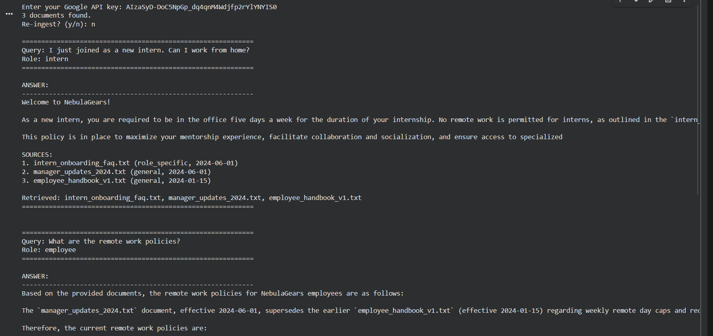

# Conflict-Aware RAG System

Google Gemini Flash 2.5 + ChromaDB + Role-Aware Policy Resolution

This project implements a local, conflict-aware Retrieval-Augmented Generation (RAG) system for the NebulaGears GenAI Intern Assessment. The system resolves contradictory company policies using metadata-based re-ranking and strict role-specific precedence.

---

## Features

- Local vector database using ChromaDB
- Embeddings: Google GenAI `models/text-embedding-004`
- LLM: Gemini Flash 2.5
- Conflict-aware document ranking using:
  - role_applicability
  - specificity (general vs role_specific)
  - effective_date
  - priority
  - embedding similarity
- Strict prompting enforcing:
  - Role-specific > General
  - Newer > Older
  - Mandatory document citations
- Deterministic fallback when generative output is blocked

---

## Project Structure

```
.
├── rag_system.py
├── requirements.txt
├── Assignement/
│   ├── employee_handbook_v1.txt
│   ├── manager_updates_2024.txt
│   └── intern_onboarding_faq.txt
└── README.md
```

---

## Setup Instructions

### 1. Activate virtual environment
```bash
venv\Scripts\activate.bat
```

### 2. Install dependencies
```bash
pip install chromadb
pip install google-generativeai
pip install python-dotenv
pip install pydantic-settings
```

Or install everything at once:
```bash
pip install -r requirements.txt
```

### 3. Set Google API Key
PowerShell:
```bash
$env:GOOGLE_API_KEY=YOUR_API_KEY_HERE
```

Or create a `.env` file:
```
GOOGLE_API_KEY=YOUR_API_KEY_HERE
```

### 4. Run the system
```bash
python rag_system.py
```

---

## Documents Ingested

### A. employee_handbook_v1.txt  
States that employees can work remotely 100% from anywhere.

### B. manager_updates_2024.txt  
Updates the remote work policy: capped at 3 days/week, approval required, mandatory office days on Tuesday and Thursday.

### C. intern_onboarding_faq.txt  
Interns must work onsite 5 days/week. Remote work is not permitted.

These contradictions are intentional and form the basis of the assessment.

---

## Conflict Resolution Logic

During ingestion, each document receives metadata:

| Metadata Field | Purpose |
|----------------|---------|
| role_applicability | Applies to intern or general employee |
| specificity | Whether role_specific or general |
| effective_date | Used for chronological override |
| priority | Higher priority indicates newer/more authoritative |

### Re-ranking Logic

If user_role = intern:
1. specificity = role_specific
2. higher priority
3. newer effective_date
4. higher similarity

If user_role = employee:
1. higher priority
2. newer effective_date
3. similarity

### Prompt Rules

- Role-specific rules override general rules
- Newer policies override old ones
- Final answer must cite documents
- Output must rely only on retrieved text

---

## Example Output (Intern Query)

**Query:**  
"I just joined as a new intern. Can I work from home?"

**Correct Answer:**  
Interns must be onsite 5 days a week. Remote work is not permitted.  
Source: intern_onboarding_faq.txt

---

## Edge Case Tests

1. Can interns work remotely on Fridays?  
2. Do interns need manager approval for remote days?  
3. What is the latest remote work policy?  
4. Is the Work-From-Anywhere program still active?  
5. On which days must interns be onsite?

These tests validate conflict resolution, role awareness, and date precedence.

---

## Cost Analysis

Assumptions:  
- 10,000 documents  
- 5,000 queries/day  
- 800 input tokens + 400 output tokens per query  
- Using Gemini Flash-Lite pricing  

Monthly usage:  
- Input tokens: ~120M → ~$12  
- Output tokens: ~60M → ~$24  

Total estimated monthly cost: **~$36/month** (LLM only)


## Output screenshot



